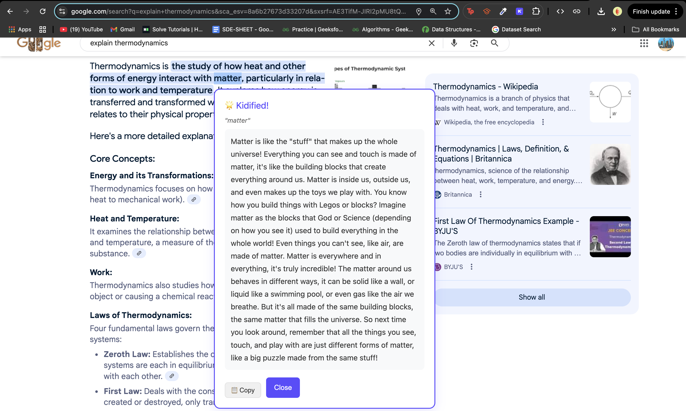
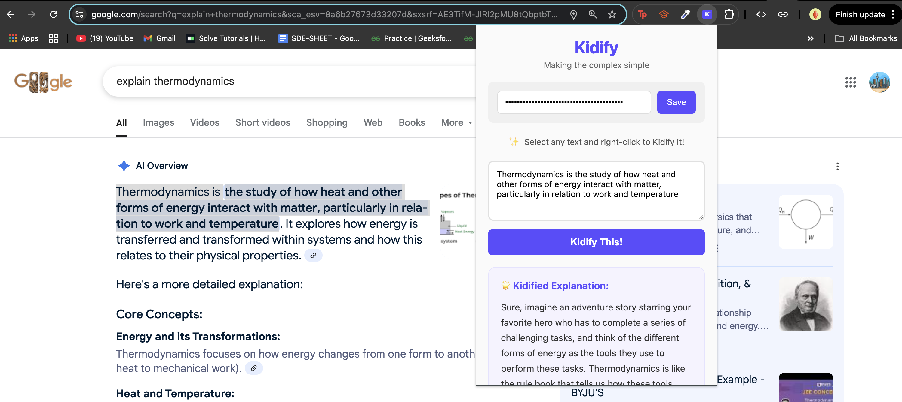

# Kidify Browser Extension

<p align="center">
  
</p>

<p align="center">
  <strong>Making the complex simple</strong><br>
  Transform complicated text into kid-friendly explanations with one click
</p>

<p align="center">
  
  
  
</p>

## ✨ Features

- 🖱️ **Right-Click Simplification** - Select any text and get instant explanations
- 💬 **Popup Interface** - Paste complex text directly into the extension
- 🤖 **AI-Powered** - Uses Cohere's advanced language models
- 🔒 **Privacy First** - Your API key stays local, never shared
- 🎨 **Beautiful UI** - Clean, kid-friendly design with smooth animations
- ⚡ **Works Everywhere** - Functions on any website

## 🚀 Installation - Load from Source 

1. **Download the extension**
   ```bash
   git clone https://github.com/yourusername/kidify-extension.git
   ```
   Or [download as ZIP](https://github.com/yourusername/kidify-extension/archive/main.zip) and extract

2. **Open Chrome Extensions**
   - Navigate to `chrome://extensions/`
   - Enable "Developer mode" (toggle in top right)

3. **Load the extension**
   - Click "Load unpacked"
   - Select the `kidify-extension` folder

4. **You're ready!** 
   - The Kidify icon should appear in your toolbar


## 🔑 Setup

### Getting Your Free API Key

1. **Create a Cohere account**
   - Visit [https://cohere.ai/](https://cohere.ai/)
   - Sign up for free
   
2. **Generate API key**
   - Go to [API Keys dashboard](https://dashboard.cohere.ai/api-keys)
   - Click "Create New Key"
   - Copy your key

3. **Add to Kidify**
   - Click the Kidify extension icon
   - Paste your API key
   - Click "Save"

That's it! Your key is stored securely in your browser.

## 💡 How to Use

### Method 1: Right-Click Menu


1. Select any complex text on a webpage
2. Right-click and select "🌟 Kidify This"
3. Read the simplified explanation in the popup

### Method 2: Extension Popup


1. Click the Kidify icon in your toolbar
2. Paste or type complex text
3. Click "Kidify This!"
4. Get your explanation instantly

### Pro Tips
- Press `Ctrl+Enter` in the text box to quickly Kidify
- Click anywhere outside the explanation popup to close it
- Your API key is saved, so you only need to enter it once

## 🛠️ Development

### Prerequisites
- Chrome browser
- Cohere API key (free)
- Basic knowledge of Chrome extensions (optional)

### Project Structure
```
kidify-extension/
├── manifest.json       # Extension configuration
├── popup.html         # Extension popup UI
├── popup.css          # Popup styles with animations
├── popup.js           # Popup logic and API calls
├── content.js         # Content script for webpage interaction
├── background.js      # Service worker for context menus
├── icons/            # Extension icons (16x16, 48x48, 128x128)
├── docs/             # Documentation and screenshots
│   ├── SETUP.md      # Detailed setup instructions
│   └── screenshots/  # UI screenshots
├── LICENSE           # MIT license
└── README.md         # You are here!
```

### Contributing

We love contributions! Here's how you can help:

1. Fork the repository
2. Create your feature branch (`git checkout -b feature/amazing-feature`)
3. Commit your changes (`git commit -m 'Add amazing feature'`)
4. Push to the branch (`git push origin feature/amazing-feature`)
5. Open a Pull Request


### Running Tests
```bash
# No automated tests yet - contributions welcome!
# Manual testing procedure:
# 1. Load extension in Chrome
# 2. Test right-click functionality on various websites
# 3. Test popup with different text inputs
# 4. Verify API key storage works correctly
```

## 🔒 Privacy & Security

- ✅ **No tracking** - We don't collect any user data
- ✅ **Local storage only** - API keys never leave your browser
- ✅ **Open source** - Review our code anytime
- ✅ **Minimal permissions** - Only what's necessary to function

## 🐛 Troubleshooting

### "Please enter your Cohere API key"
- Ensure you've saved your API key in the extension popup
- Get a free key from [Cohere.ai](https://cohere.ai/)

### "Failed to get explanation"
- Check your internet connection
- Verify your API key is correct and active
- Ensure you haven't exceeded Cohere's rate limits
- Try refreshing the page

### Extension icon not appearing
- Make sure the extension is enabled in `chrome://extensions/`
- Try reloading the extension
- Restart Chrome

### Right-click menu not showing
- Refresh the webpage after installing
- Check that you have text selected
- Ensure the extension has proper permissions

## 📊 Browser Support

| Browser | Support |
|---------|---------|
| Chrome  | ✅ Full support (v88+) |
| Edge    | ✅ Full support (Chromium-based) |
| Brave   | ✅ Full support |
| Firefox | ❌ Not yet (different extension API) |
| Safari  | ❌ Not yet |

## 🗺️ Roadmap for future development

- [ ] Firefox support
- [ ] Custom explanation styles (even simpler, more detailed, etc.)
- [ ] History of explanations
- [ ] Offline mode with cached explanations
- [ ] Dark mode
- [ ] Multiple language support
- [ ] Chrome Web Store release

## 📄 License

This project is licensed under the MIT License - see the [LICENSE](LICENSE) file for details.

## 🙏 Acknowledgments

- Powered by [Cohere AI](https://cohere.ai/) - Amazing AI models
- Icons from [Icons8](https://icons8.com/) 
- Inspired by the need to make information accessible to everyone
- Thanks to all our [contributors](https://github.com/yourusername/kidify-extension/graphs/contributors)

## 📧 Contact

- Report bugs: [GitHub Issues](https://github.com/yourusername/kidify-extension/issues)
- Feature requests: [GitHub Discussions](https://github.com/yourusername/kidify-extension/discussions)
- Security issues: Please email directly (see profile)

---

<p align="center">
  Made with ❤️ by developers who believe in making the web more understandable
</p>

<p align="center">
  <a href="https://github.com/yourusername/kidify-extension/stargazers">⭐ Star us on GitHub!</a>
</p>
